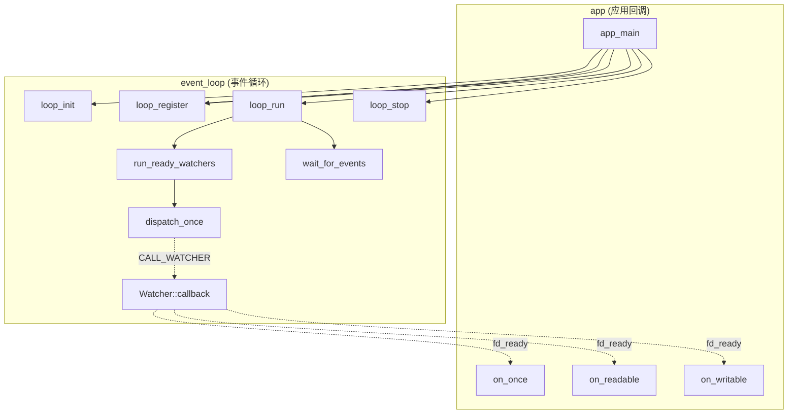

# 代码逆向分析 Demo

- Run: `run_20260827_clang_demo`
- Build profile: `demo-poll`
- Analyzer: `clang++ -Xclang -ast-dump=json`
- Nodes: 12 / Edges: 13
- Verification: 100%

## 模块架构

- **app (应用回调)**: 应用回调、核心逻辑
  - Files: `demo/sample/app.cpp`
  - Symbols: `app_main、on_once、on_readable、on_writable`
- **event_loop (事件循环)**: 事件分发、事件循环驱动、事件等待、回调注册、核心逻辑
  - Files: `demo/sample/event_loop.cpp`, `demo/sample/event_loop.h`
  - Symbols: `Watcher::callback、dispatch_once、loop_init、loop_register、loop_run、loop_stop、run_ready_watchers、wait_for_events`

Dependencies: `app -> event_loop`, `event_loop -> app`

## 调用关系图

## 关键调用链

- `app_main -> loop_stop` (leaf)
- `app_main -> loop_register` (leaf)
- `app_main -> loop_register` (leaf)
- `app_main -> loop_register` (leaf)
- `app_main -> loop_run -> wait_for_events` (leaf)
- `app_main -> loop_run -> run_ready_watchers -> dispatch_once -> Watcher::callback -> on_readable` (leaf)
- `app_main -> loop_run -> run_ready_watchers -> dispatch_once -> Watcher::callback -> on_once` (leaf)
- `app_main -> loop_run -> run_ready_watchers -> dispatch_once -> Watcher::callback -> on_writable` (leaf)
- `app_main -> loop_init` (leaf)

## 自然语言分析

# 自然语言分析

## 模块架构
样例由 app (应用回调)、event_loop (事件循环) 组成。应用入口负责初始化事件循环、注册回调并启动轮询；事件循环组件负责等待就绪事件、遍历 watcher 并分发回调。

## 关键调用链
入口 `app_main` 的关键路径是：`app_main -> loop_run -> run_ready_watchers -> dispatch_once -> Watcher::callback -> on_readable`。

## 异步回调链
fd_ready 事件在 demo/sample/event_loop.cpp:19 触发回调，候选为 on_once、on_readable、on_writable

## 函数指针
静态分析发现回调字段存在多个候选：`on_once、on_readable、on_writable`，无法唯一确定目标，置信度为 0.60。

## 复杂宏
本次分析覆盖：CALL_WATCHER (demo/sample/event_loop.cpp:3)、LOOP_BACKEND (demo/sample/event_loop.h:9)。宏展开记录已挂到对应调用边的 `macro_stack` 证据上。

## 结论
验证覆盖率为 100%，报告状态为 ready；所有结论均引用源码文件、行号和原始代码片段。

## 异步回调链

- `demo/sample/event_loop.cpp:7` `fd_ready` -> `demo/sample/app.cpp:26` -> `demo/sample/event_loop.cpp:19` -> callbacks: on_once, on_readable, on_writable
  - Confidence: 0.60, loop back: True

## 函数指针候选

- `Watcher::callback` @ `demo/sample/event_loop.cpp:19`
  - Candidates: `on_once` (demo/sample/app.cpp:17), `on_readable` (demo/sample/app.cpp:5), `on_writable` (demo/sample/app.cpp:11)
  - Confidence: 0.60

## 宏分析

| macro | file:line | definition | call sites |
| --- | --- | --- | --- |
| `CALL_WATCHER` | `demo/sample/event_loop.cpp:3` | `((watcher)->callback(events))` | 1 |
| `EVENT_READ` | `demo/sample/event_loop.h:4` | `0x01` | 3 |
| `EVENT_WRITE` | `demo/sample/event_loop.h:5` | `0x02` | 2 |
| `LOOP_BACKEND` | `demo/sample/event_loop.h:9` | `"poll"` | 1 |

## Evidence

| id | kind | file:line | snippet |
| --- | --- | --- | --- |
| `ev_0027cd5acd0f` | assignment | `demo/sample/app.cpp:27` | `loop_register(&loop, 1, on_writable);` |
| `ev_2907f5c10837` | assignment | `demo/sample/app.cpp:26` | `loop_register(&loop, 0, on_readable);` |
| `ev_2bc375cf27d5` | call_site | `demo/sample/event_loop.cpp:19` | `CALL_WATCHER(watcher, events);` |
| `ev_79a6829a0ac1` | call_site | `demo/sample/app.cpp:25` | `loop_init(&loop);` |
| `ev_81efb252595d` | call_site | `demo/sample/event_loop.cpp:26` | `dispatch_once(loop, watcher, events);` |
| `ev_82211e5f28dc` | call_site | `demo/sample/app.cpp:29` | `loop_run(&loop);` |
| `ev_a2169417fd49` | call_site | `demo/sample/app.cpp:27` | `loop_register(&loop, 1, on_writable);` |
| `ev_b8b0d8d19f85` | call_site | `demo/sample/app.cpp:26` | `loop_register(&loop, 0, on_readable);` |
| `ev_c7caa85aaeb5` | call_site | `demo/sample/event_loop.cpp:48` | `run_ready_watchers(loop, events);` |
| `ev_d61a532389ff` | call_site | `demo/sample/app.cpp:30` | `loop_stop(&loop);` |
| `ev_da515d150c0c` | assignment | `demo/sample/app.cpp:28` | `loop_register(&loop, 2, on_once);` |
| `ev_da74b82fb9e8` | call_site | `demo/sample/app.cpp:28` | `loop_register(&loop, 2, on_once);` |
| `ev_e3eef1e5713e` | call_site | `demo/sample/event_loop.cpp:47` | `int events = wait_for_events(loop, 100);` |
