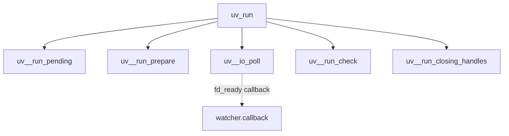
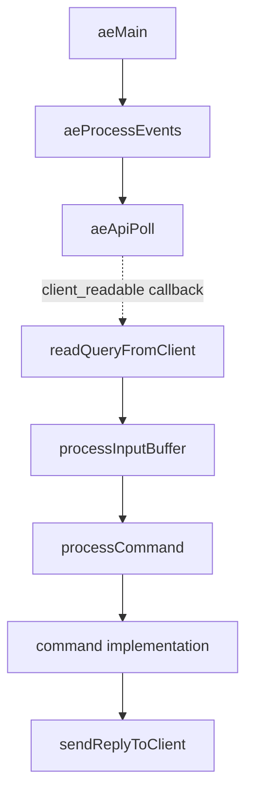

# Demo 验证报告

## libuv：`uv_run`

结论：`uv_run` 是循环调度器；I/O backend 只负责报告就绪事件，具体 handle 的 watcher callback 才推进用户态状态机。回调边必须单独标识，并带事件循环线程上下文。

## Redis：客户端请求

结论：Redis 的 socket 就绪事件先进入客户端输入缓冲区，再经过协议解析和命令分发；`epoll`、`kqueue`、`select` 只替换 `aeApiPoll` 的平台实现。

## 通过条件

- 结果 JSON 可被 `agent-result.schema.json` 解析。
- 直接调用和回调边被区分。
- 平台条件附着在边上。
- 每条边有证据对象；fixture 行号为占位值，接入真实源码适配器后必须替换。
